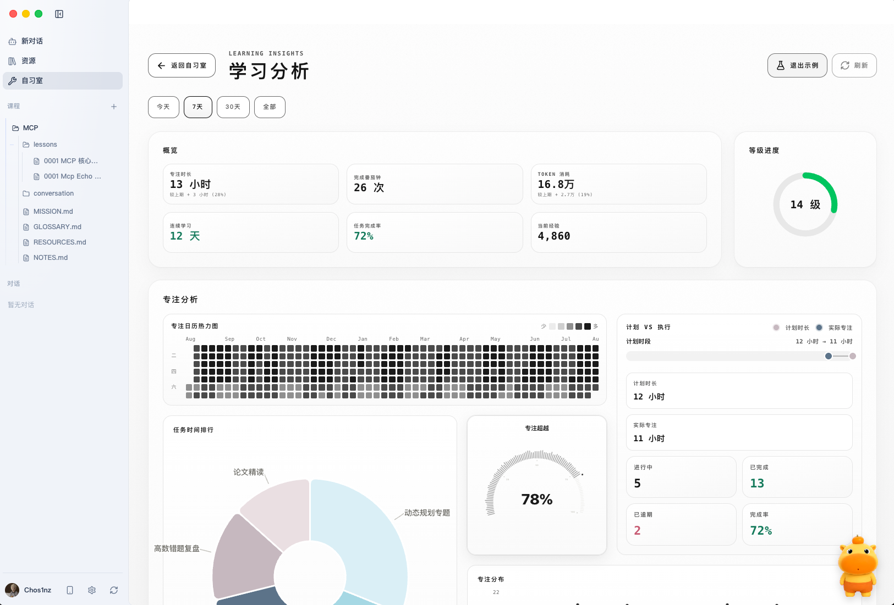
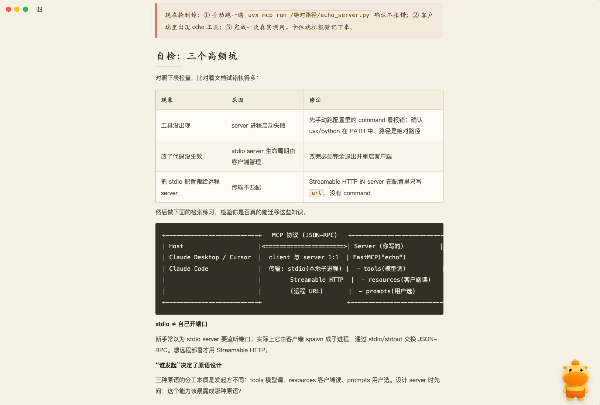
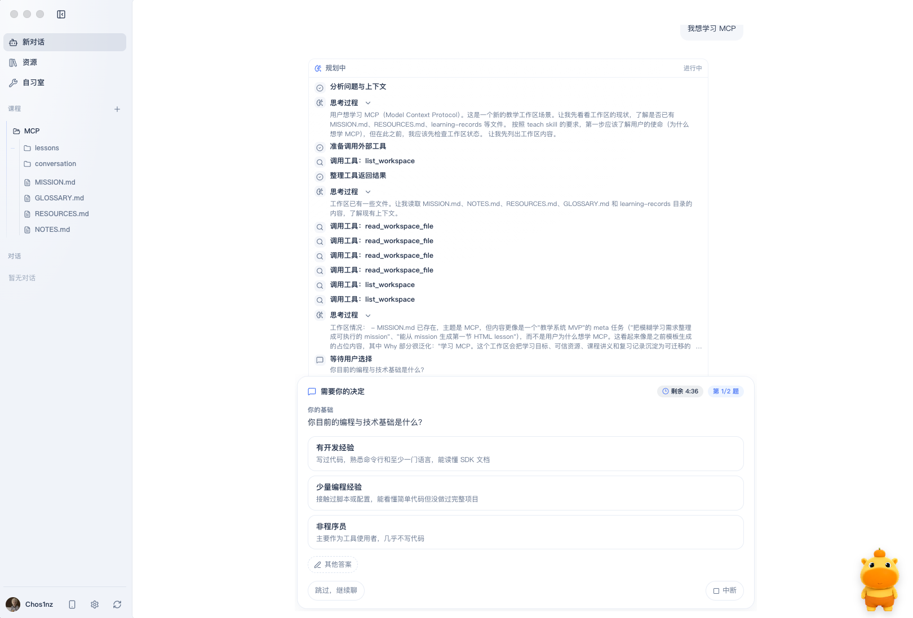

<p align="center">
  
</p>

<h1 align="center">StudiumX</h1>

<p align="center"><em>本地优先的 AI 教学工作区 — 把目标、课程、资源与学习记录沉淀为可持续演进的学习资产</em></p>

<p align="center"><a href="https://studiumx.cn/app">在线自习室体验</a></p>

<p align="center">
  
  
  
  
  
  
  
</p>

<p align="center">
  
  
</p>

<p align="center">
  
  
</p>

StudiumX 是一个以**学习工作区**为中心的桌面应用。它将 AI 辅助教学、学习计划、专注任务、资源库和学习分析放入同一个本地工作流；学习目标、课程讲义、可信资源与学习记录保存在你自己的工作区中，而不是被普通聊天记录替代。

## 目录

- [核心特性](#核心特性)
- [技术栈](#技术栈)
- [仓库结构](#仓库结构)
- [快速开始](#快速开始)
- [常用命令](#常用命令)
- [数据、隐私与工具权限](#数据隐私与工具权限)
- [AI 教学能力](#ai-教学能力)
- [测试与验证](#测试与验证)
- [开发文档](#开发文档)
- [许可证](#许可证)

## 核心特性

- **文件优先的学习工作区**：围绕 `MISSION.md`、`RESOURCES.md`、课程、参考资料和学习记录组织长期学习资产；AI 制定下一步教学计划时，以工作区文件和 LearningSession ledger 中的教学事实为准。
- **持续的 AI 教学对话**：从明确学习目标开始，协助规划学习路径、生成课程、沉淀资源与记录，并保留可追溯的对话与教学过程。
- **学习计划与专注工作台**：提供任务、日程、专注计时、学习空间、进度与学习分析等配套能力，帮助把教学计划落到每天的行动中。
- **资源与课程管理**：集中查看学习资源、课程讲义、参考资料及本地学习成果；课程产物适合保存、回顾和打印。
- **可配置的 AI 与扩展接入**：支持配置模型提供商；MCP 连接、工作区工具和远程控制均在明确的产品与安全边界内提供。
- **本地优先、显式授权**：不默认上传遥测数据；工作区命令按 [ADR-0153](docs/adr/0153-codex-sandbox-dual-axis-and-agent-shell.md) 默认可用、但受双轴审批与路径围栏约束；涉及写入、外部写入和特权操作的工具都要经过 effect 分类与审批策略。

## 技术栈

- Electron 42 + React 19 + TypeScript 6
- electron-vite + Vite 7
- Tailwind CSS 4 + Zustand + i18next
- SQLite（`better-sqlite3`）用于本地投影、索引和用户状态
- Model Context Protocol SDK（MCP）与受控工具执行层
- Vitest + Playwright + TypeScript 类型检查与领域安全检查

## 仓库结构

```text
StudiumX/
├── build/                  # 应用图标与打包资源
├── src/
│   ├── main/               # Electron 主进程：教学、AI、持久化、MCP 与工作区宿主
│   ├── preload/            # 安全的 Electron IPC 桥接层
│   ├── renderer/           # React 桌面界面：对话、工作台、资源、设置等
│   └── shared/             # 主进程与渲染进程共享的类型、协议和领域规则
├── web/                    # Web 适配层与查看/远程能力入口（非教学执行引擎）
├── tests/                  # unit、integration、Electron e2e 与可访问性测试
├── scripts/                # Doctor、契约、安全与发布审计脚本
├── docs/adr/               # 架构决策记录（ADR）
├── CONTRIBUTING.md         # 贡献流程与验证要求
├── SECURITY.md             # 产品信任边界
└── package.json            # 脚本、依赖与运行时约束
```

## 快速开始

### 前置条件

- Node.js `>= 22 < 25`（项目使用 Node 22）
- pnpm `11`（通过 Corepack 管理）

### 1. 安装依赖

```bash
corepack enable
pnpm install
```

### 2. 启动桌面端开发环境

```bash
pnpm dev
```

该命令会启动 Electron 桌面应用，并开启渲染层热更新。

### 3. 配置学习工作区与 AI 提供商

在应用中打开或创建学习工作区，写下具体的 `MISSION.md`，然后在设置中按需配置模型提供商。不要把 API 密钥提交到 Git；应用会将此类敏感配置隔离在本地安全存储中。

### 4. （可选）启动 Web 适配开发环境

```bash
pnpm dev:web
```

Web 端用于受限的查看、同步和远程能力适配；它不是教学执行引擎，不承载模型密钥、Agent loop 或本地工作区文件写入。

## 常用命令

```bash
pnpm dev                         # 启动 Electron 桌面端开发环境
pnpm dev:web                     # 启动 Web 适配开发环境
pnpm build                       # 类型检查并构建桌面端
pnpm build:web                   # 构建 Web 端
pnpm typecheck                   # TypeScript 类型检查
pnpm typecheck:web               # Web 端类型检查
pnpm test:unit                   # 运行单元测试
pnpm test:integration            # 运行集成测试
pnpm test:e2e                    # 构建后运行 Electron 端到端测试
pnpm test:a11y                   # 构建后运行可访问性测试
pnpm doctor -- --json            # 输出脱敏的本地运行状况诊断
pnpm run check:security          # 检查安全、隐私与外部内容边界
pnpm run check:tool-contract     # 检查工具注册表、effect 与写入策略契约
pnpm run check:teaching-evidence # 检查教学证据链关键不变量
pnpm run check:prepush           # 类型检查 + 安全检查的本地预提交子集
```

## 数据、隐私与工具权限

StudiumX 的教学决策遵循文件优先原则：学习目标、资源、课程、学习记录及 LearningSession ledger 构成教学事实的权威来源。SQLite 可保存索引、分析、偏好与其他本地产品状态，但不会取代教学事实的权威地位。

应用不会默认开启远程遥测。工作区 shell 默认开启但受双轴审批与路径围栏约束（ADR-0153）。工具按 `read`、`workspace_write`、`external_write`、`privileged` 分类；未知工具会失败关闭，写入及高风险操作由审批策略控制。MCP 设置仅提供连接的列表、编辑、导入与 OAuth 流程，密钥和令牌不会出现在公开 DTO、Doctor 输出或支持包中。

完整的信任模型和约束请阅读 [`SECURITY.md`](SECURITY.md) 与 [`docs/tools/TOOL_CONTRACT.md`](docs/tools/TOOL_CONTRACT.md)。

## AI 教学能力

AI 在 StudiumX 中服务于学习工作流，而非取代它的长期记录。典型使用方式包括：

- 将模糊的学习诉求收敛为可执行的学习目标与计划
- 围绕已有进度、练习表现和可信资源组织下一步教学
- 生成并迭代可保存的课程讲义、参考资料和学习记录
- 在教学对话中跟踪过程、结果与后续复习线索

模型提供商和工具能力均由用户配置。涉及本地文件、网络或外部系统的操作必须符合工作区范围、effect 策略和审批要求。

## 测试与验证

提交前请按改动范围运行对应检查；下面是一组常用的基础组合：

```bash
pnpm typecheck
pnpm run check:security
pnpm run check:tool-contract
pnpm test:unit
```

若改动教学会话、证据、结果结算或工作区写入路径，还应运行：

```bash
pnpm run check:teaching-evidence
```

详细的贡献要求、领域门禁和按路径选择的验证命令见 [`CONTRIBUTING.md`](CONTRIBUTING.md) 与 [`AGENTS.md`](AGENTS.md)。

## 开发文档

- [`docs/domain-language.md`](docs/domain-language.md) — 产品领域术语与命名约定
- [`CONTRIBUTING.md`](CONTRIBUTING.md) — 安装、协作与 PR 验证要求
- [`SECURITY.md`](SECURITY.md) — 安全、隐私、MCP 与工具权限边界
- [`docs/adr/README.md`](docs/adr/README.md) — 已实施架构决策索引
- [`docs/tools/TOOL_CONTRACT.md`](docs/tools/TOOL_CONTRACT.md) — 工具 effect、审批与写入契约
- [`studiumx-settings.example.json`](studiumx-settings.example.json) — 不含密钥的设置文件示例
- [`docs/desktop-release.md`](docs/desktop-release.md) — 桌面端发布说明

## 社区

本开源项目已链接并感谢 [LINUX DO 社区](https://linux.do) 的支持与交流。

## 许可证

AGPL-3.0（许可证标识见 `package.json`）
